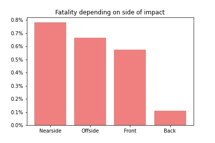

<h1> Analiza wypadków drogowych w Wielkiej Brytanii   w latach 2005-2015
<h3> Antoni Zajko

---

 <h2> Zbior danych  

<a href="https://www.kaggle.com/silicon99/dft-accident-data">
UK Car Accidents 2005-2015
</a>  
Zbiór zawiera informacje dotyczące około 1,8 mln wypadków drogowych.  
Oprócz danych dotyczących samych wypadków są także dane dotyczące pojazdów, a także ofiar.

---

<h1> Użyte narzędzia</h1>
 
<li> Python
<li> Pandas
<li> Matplotlib
<li> Seaborn

---
<h1>Jakie manewry na drodze są najbardziej ryzykowne?</h1>

Największa szansa na wypadek jest podczas skręcania. Wynika to najpewniej z tego, że ten manewr wykonujemy najczęsciej, oraz bardzo łatwo jest podczas niego wymusić pierszeństwo, co jest jedną z najczęstszych przyczyn wypadków na drodze.

---

<h1> Czy pojazd, którym się poruszamy ma wpływ na śmiertleność podczas wypadku?

Z wykresu wynika, że największa szansa na śmierć podczas wypadku jest podczas jazdy tramwajem. Warto też zwrócić na wysoką śmiertelność wypadków podczas jazdy motocyklem.

---

<h1> Uderzenie z której strony w pojazd jest najbardziej śmiertelne?</h1>

---

<h1> Skuteczność kampanii działających przeciwko wypadkom

---

<h1> Ogólny trend w ilości wypadków

---

<h1> Porównanie lat z kampanią i bez kampanii

---

<h1>Dziękuje za obejrzenie prezentacji
<h3>Antoni Zajko